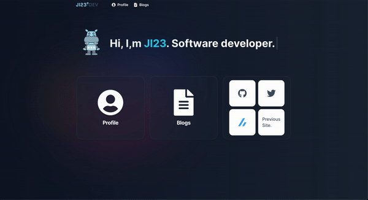

# JI23's Personal Website ⚡️

> https://ji23-dev.com/


### Website Preview

<p align="center">
  <kbd>
    <a href="https://ji23-dev.com" target="_blank">
  </a>
  </kbd>
</p>

## Features 📋

⚡️ Fully Responsive\
⚡️ Building a JAMstack CMS with React / Next.js / TypeScript / Vercel / microCMS\
⚡️ Consistent design using Tailwind CSS

## Sections 📚

✔️ Profile \
✔️ Blogs

## Getting Started 📦

First, run the development server:

```bash
npm install
npm run dev
```

Open [http://localhost:3000](http://localhost:3000) with your browser to see the result.

## Author 📄

[@JJ_1123_I](https://twitter.com/JJ_1123_I)
